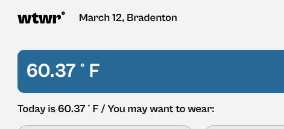
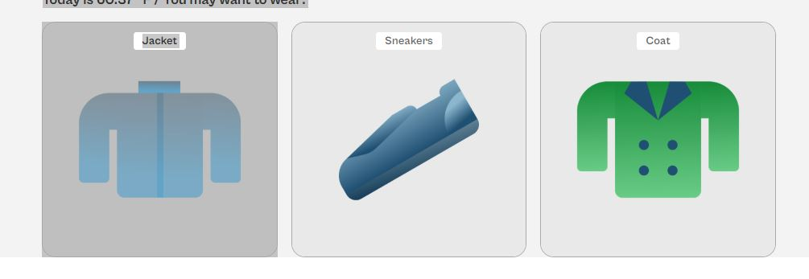
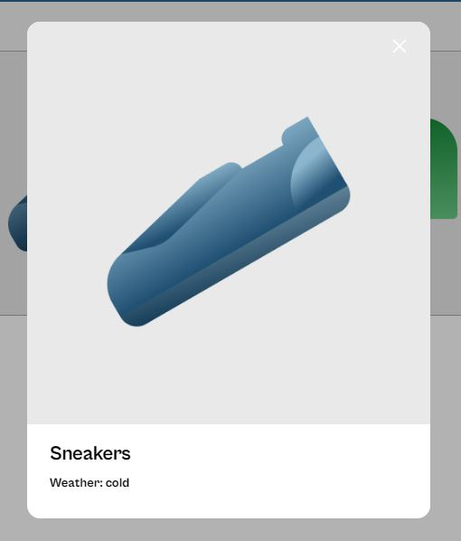
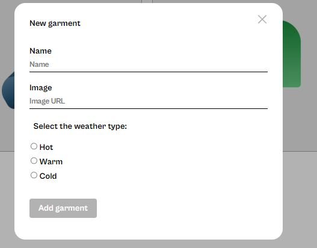

# WTWR (What to Wear?)

This web applications is meant to tell the user which items they should wear based on the weather in their locations.

## Screenshots

This shows the temp in the users area.

This tells the user the appropriate clothes to wear for the weather events.

Able to expand on the picture.

Also the ability to add new clothing items.

## Features

- Fetches weather data from OpenWeather API
- Suggests clothing based on weather conditions
- Uses user's location to get the weather
- Responsive UI

## Tech Used

- React.js
- Node.js
- OpenWeather API
- CSS Modules

## Git Hub link

[Visit the GitHub link](https://milialeana.github.io/se_project_react/)
